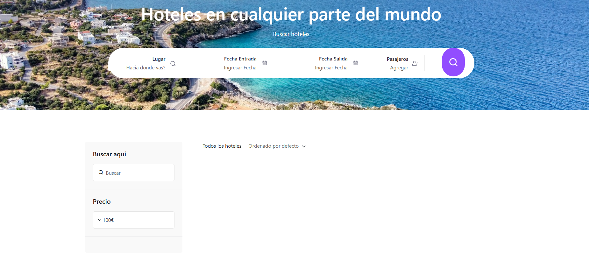

# 🏨 Hotel Reservation App  

Aplicación web fullstack desarrollada con **Spring Boot (Java)** y **Angular** como parte del curso **"Spring Boot & Angular: Construye aplicación reserva hotelera"**.  

El objetivo del proyecto fue construir desde cero un sistema de **reservas de hoteles**, aplicando buenas prácticas de programación, arquitectura de software y metodologías ágiles.  

## 🚀 Tecnologías principales  
- **Backend:** Java 17, Spring Boot, Spring Data JPA, MySQL, Stored Procedures, OpenAPI, Docker  
- **Frontend:** Angular, HTML5, SCSS, Responsive Design  
- **Metodología:** Scrum  

## 📌 Funcionalidades destacadas  
- Búsqueda de hoteles por ciudad y fechas  
- Consulta de disponibilidad de habitaciones  
- Gestión de reservas en base de datos  
- Documentación automática de la API con Swagger  
- Despliegue con Docker  

## 📸 Capturas de pantalla  

### Búsqueda de hoteles

### Lista de hoteles disponibles

## 🎯 Aprendizajes clave  
- Desarrollo de aplicaciones fullstack  
- Diseño de bases de datos relacionales  
- Creación de microservicios con Spring Boot  
- Integración de Angular con backend REST  
- Gestión de proyectos con metodología Scrum

